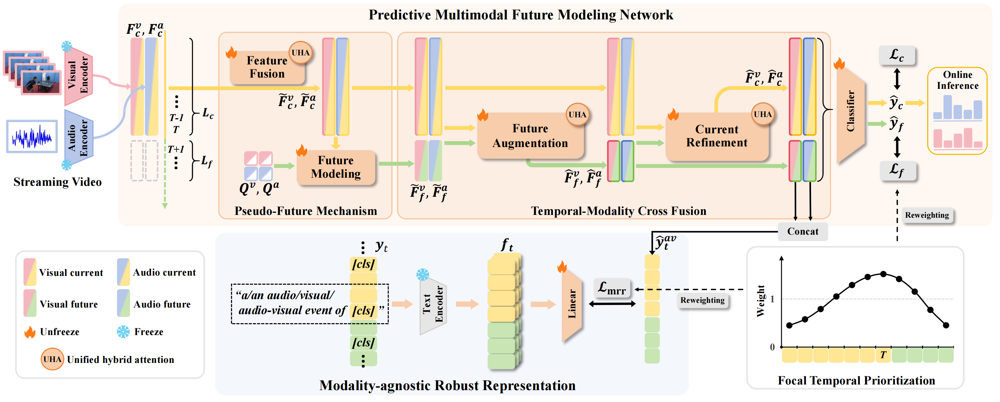

# [NeurIPS 2025] PreFM: Online Audio-Visual Event Parsing via Predictive Future Modeling
Welcome! This is the official repo of the paper "[PreFM: Online Audio-Visual Event Parsing via Predictive Future Modeling](https://arxiv.org/abs/2505.23155)"

## Framework


## Installation

1.  **Create and activate the Conda environment:**
    ```bash
    conda create --name PreFM python=3.10.12
    conda activate PreFM
    ```

2.  **Install dependencies:**
    ```bash
    pip install -r requirements.txt
    ```

3.  **Navigate to the code directory:**
    ```bash
    cd code
    ```

## Dataset Preparation

1.  **Download Datasets:**
    Download the LLP and UnAV-100 datasets from the following link: **[Google Drive](https://drive.google.com/drive/folders/1GGIoHxej_PhsTLE-n_hl_oTvj-BXsJh3?usp=drive_link)**, **[Hugging Face](https://huggingface.co/datasets/Yang1213112131/PreFM)**

2.  **Directory Structure:**
    Please organize the downloaded datasets into the following structure under the `dataset` directory:

    ```
    dataset
    |-- LLP
    |   |-- data
    |   |   |-- CLAP
    |   |   |-- CLIP
    |   |   `-- st
    |   `-- label
    |       |-- feature_label   # Labels for features
    |       |   |-- audio
    |       |   `-- visual
    |       `-- label           # Event category labels
    |           |-- audio
    |           `-- visual
    |-- UnAV-100
    |   |-- data
    |   |   |-- CLAP
    |   |   |-- CLIP
    |   |   `-- onepeace        # Audio-visual data processed by OnePeace
    |   `-- label
    |       |-- feature_label   # Labels for features
    |       |   |-- test
    |       |   |-- train
    |       |   `-- val
    |       |-- feature_label_modified # Feature labels for PreFM+ on the On AVEL task
    |       |   |-- test
    |       |   |-- train
    |       |   `-- val
    |       |-- label_clip_clap # Event category labels
    |       |   |-- test
    |       |   |-- train
    |       |   `-- val
    |       `-- label_onepeace  # Event category labels for PreFM+ on the On AVEL task
    |           |-- test
    |           |-- train
    |           `-- val
    ```

## Pre-trained Models

1.  **Download Weights:**
    Download our pre-trained model weights from the following link: **[Google Drive](https://drive.google.com/drive/folders/1GGIoHxej_PhsTLE-n_hl_oTvj-BXsJh3?usp=drive_link)**, **[Hugging Face](https://huggingface.co/datasets/Yang1213112131/PreFM)**

2.  **Directory Structure:**
    Place the downloaded weights into the `models` directory with the following structure:
    ```
    models
    |-- PreFM+_On_AVEL
    |   `-- checkpoint_best_ori.pt
    |-- PreFM+_On_AVVP
    |   `-- checkpoint_best_ori.pt
    |-- PreFM_On_AVEL
    |   `-- checkpoint_best_ori.pt
    `-- PreFM_On_AVVP
        `-- checkpoint_best_ori.pt
    ```

## Evaluation

To evaluate a model, run the corresponding test script. For example, to test the PreFM model on the On AVEL task:

```bash
bash scripts/test_PreFM_On_AVEL.sh | tee ./logs/PreFM_On_AVEL/val_res.txt
```

## Training

To train a model from scratch, run the corresponding training script. For example, to train the PreFM model on the On AVEL task:

```bash
bash scripts/train_PreFM_On_AVEL.sh | tee ./logs/PreFM_On_AVEL/train_res.txt
```

The training progress and final results will be logged to the specified file.

## Acknowledgements

Our implementation builds upon open-source resources from **[VALOR](https://github.com/Franklin905/VALOR)**, **[LLP](https://github.com/YapengTian/AVVP-ECCV20)**, **[UnAV-100](https://github.com/ttgeng233/UnAV)** and **[OnePeace](https://github.com/OFA-Sys/ONE-PEACE)**. We thank their authors for sharing their code, datasets and pre-trained models.

## Citation

If you find our work useful, please consider citing:
```bash
@article{yu2025prefm,
  title={PreFM: Online Audio-Visual Event Parsing via Predictive Future Modeling},
  author={Yu, Xiao and Fang, Yan and Jin, Xiaojie and Zhao, Yao and Wei, Yunchao},
  journal={arXiv preprint arXiv:2505.23155},
  year={2025}
}
```
